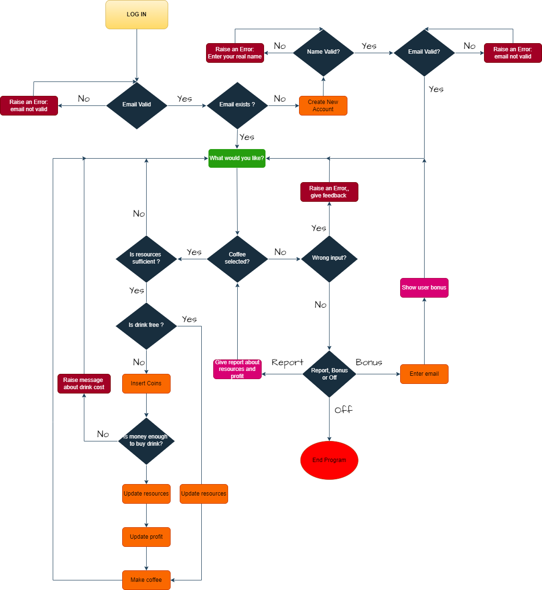
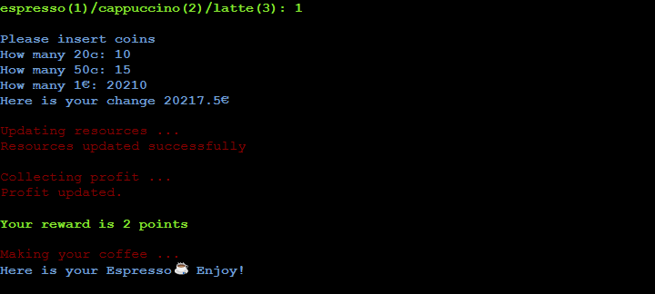
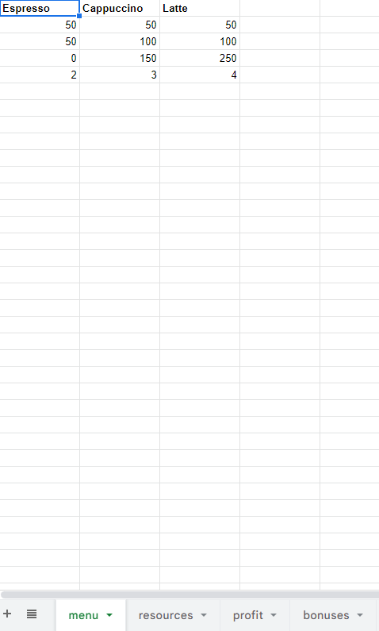
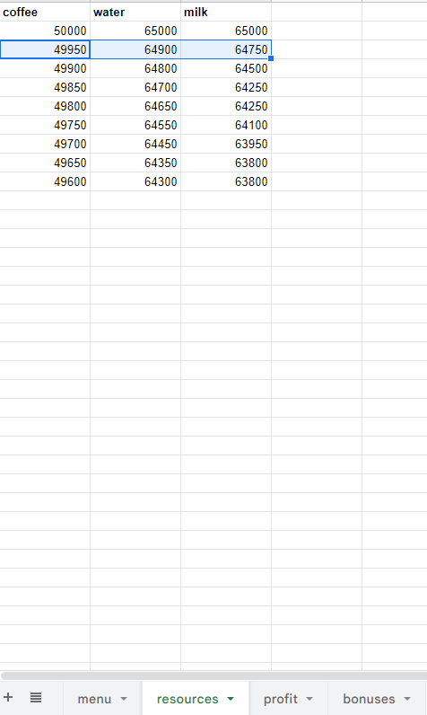
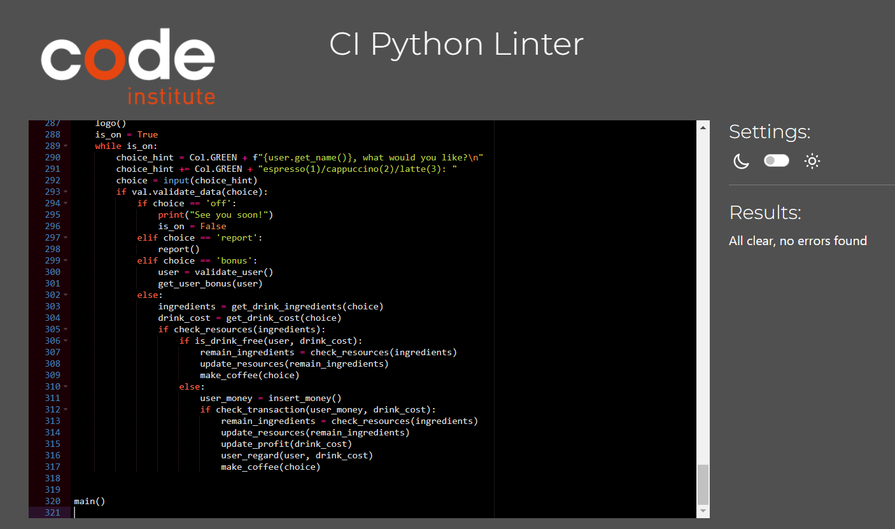
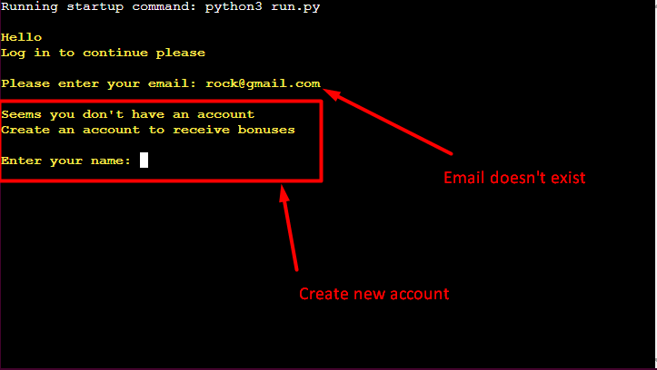
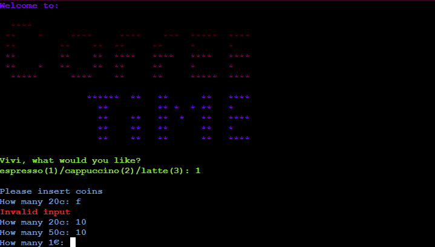
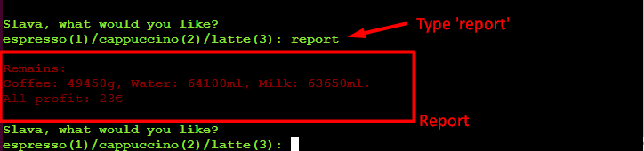
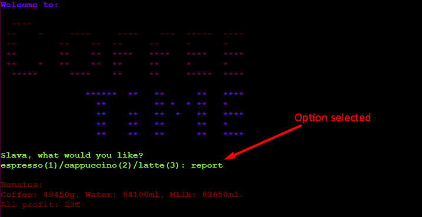
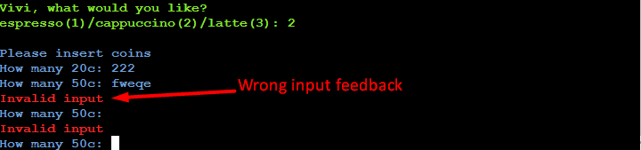

# COFFEE MACHINE PROGRAM

**Developer: Slava Kondriianenko**

💻 [Visit live website](https://ci-pp3-coffee-machine.herokuapp.com/)


## About

This is a command-line program for the Coffee Machine

User can log in to coffee machine, order coffee, insert coins and wait for their favourite drink. Also program gives opportunity to collect bonuses to get free drink if bonuses enough for it. Program updates google sheets while user makes coffee.

## Table of Contents
- [COFFEE MACHINE PROGRAM](#coffee-machine-program)
  - [About](#about)
  - [Table of Contents](#table-of-contents)
  - [Project Goals](#project-goals)
    - [User Goals](#user-goals)
    - [Site Owner Goals](#site-owner-goals)
  - [User Experience](#user-experience)
    - [Target Audience](#target-audience)
    - [User Requirements and Expectations](#user-requirements-and-expectations)
    - [User Manual](#user-manual)
      - [Log in](#log-in)
      - [Program started](#program-started)
      - [Drink chosen](#drink-chosen)
      - [Drink prepared](#drink-prepared)
      - [Report](#report)
      - [Bonus](#bonus)
      - [Off](#off)
  - [User Stories](#user-stories)
    - [Users](#users)
    - [Coffee machine Owner](#coffee-machine-owner)
  - [Technical Design](#technical-design)
    - [Flowchart](#flowchart)
    - [Languages](#languages)
    - [Frameworks \& Tools](#frameworks--tools)
    - [Libraries](#libraries)
      - [Python Libraries](#python-libraries)
      - [Third Party Libraries](#third-party-libraries)
  - [Features](#features)
    - [Log in](#log-in-1)
    - [Program started](#program-started-1)
    - [Drink choosen](#drink-choosen)
    - [Money inserted](#money-inserted)
    - [Drink Prepared](#drink-prepared-1)
    - [Report](#report-1)
    - [Bonus](#bonus-1)
    - [Turn Off Coffee Machine](#turn-off-coffee-machine)
    - [Google Sheets](#google-sheets)
  - [Validation](#validation)
  - [Testing](#testing)
    - [Manual Testing](#manual-testing)
    - [Automated Testing](#automated-testing)
  - [Bugs](#bugs)
  - [Deployment](#deployment)
    - [Heroku](#heroku)
    - [Forking the GitHub Repository](#forking-the-github-repository)
    - [Making a Local Clone](#making-a-local-clone)
  - [Credits](#credits)
  - [Acknowledgements](#acknowledgements)


## Project Goals

### User Goals

- Log in to coffee machine
- Order favourite coffee
- Easy menu to order coffee
- Be able to insert money to buy coffee
- Collect bonuses

### Site Owner Goals

- Create program to let user order coffee
- Ensure that users understand the ways to make coffee
- Create a program that gives feedback to the user whilst program running

## User Experience

### Target Audience

- People, who loves coffee
- Coffee machine makers, who want software for their machines

### User Requirements and Expectations

- A simple, error-free program
- Straightforward navigation
- Feedback through program running

### User Manual

<details><summary>Click here to view instructions</summary>

#### Log in
- Program ask user to log in.
- If user exists than program take account and work with it
- If user doesn't exists, program ask user to make account to receive bonuses   

#### Program started
- On the top of the program user can see logo and question what want user to drink
- Program checks wrong input, rises an error if it wrong and shows allowed inputs
- Coffee machine allows: '1', '2', '3' for choosing drink, 'off' and 'report' to off machine or see profit and resourses left respectively or 'bonus' to see how many bonuses user has.
                                    
#### Drink chosen
- Program checks if there are enough resourses in coffee machine to make drink
- Program cheks is there are enough bonuses to make free coffee
- If bonuses enough - program gives user feedback that drink is free 
- If bonuses not enough for free drink - program asks to insert coins by number input
- Coffee machine asks how many 20c, 50c and 1€ user will insert
  - if inserted money enough program makes choosen drink and gives user change
  - if inserted money not enough program raises massage about refund money and how much drink costs

#### Drink prepared
- Program updates resourses in google sheet 
- Program updates profit in google sheet according to the cost of the drink
- If user buy drink - program gives bonus and update account in google sheet
- Program raises massage about prepared drink

#### Report
- User can check report about resourses left and profit

#### Bonus
- User can check their bonus
- Program gives feedback how much bonus user should have to get free drink

#### Off
- To stop program user can type "off" in main menu
</details>

## User Stories

### Users
1. I want to log in to program
2. I want to have clear options to select drink
3. I want to be able to insert money 
4. I want to get change if I insert more money than drink cost
5. I want to receive a real time feedback throughout the program running
6. I want to collect bonuses
7. I want to check my bonuses
8. I want to have free drink with collected bonuses
9. I want to see report
10. I want to be able to turn off the coffee machine

### Coffee machine Owner
11. I want users to easily select options from the menu
12. I want the user to get feedback in case of wrong input
13. I want collect profit after user insert money
14. I want to let user to see report after authorization
15. I want to validate wrong email input
16. I want to update google sheets while user makes their drink

## Technical Design

### Flowchart

The following flowchart summarises the structure and logic of the application.

<details><summary>Flowchart</summary>

</details>

### Languages

- [Python](https://www.python.org/) programming language for the logic of the program

### Frameworks & Tools

- [Diagrams.net](https://app.diagrams.net/) was used to draw program flowchart
- [Google Sheets](https://www.google.co.uk/sheets/about/) were used to store drinks menu, resources and profit
- [Google Cloud Platform](https://cloud.google.com/cloud-console/) was used to manage access and permissions to the Google Services such as Google auth, sheets etc.
- [GitHub](https://github.com/) was used as a remote repository to store project code
- [Heroku Platform](https://dashboard.heroku.com/) was used to deploy the project into live environment

### Libraries

#### Python Libraries

- [unittest](https://docs.python.org/3/library/unittest.html) - used to carry out testing on single units in validation.py file

#### Third Party Libraries

- [colorama](https://pypi.org/project/colorama/) - Used this library to add color to the terminal and enhance user experience. I marked warning/error information with color red and user feedback with blue and green. Yellow color used for email verification. 
- [email_validator](https://pypi.org/project/email-validator/) - This library used to validate if user email input is of the form name@</span>example.com
- [gspread](https://docs.gspread.org/en/latest/) - Used gspread to add and manipulate data in the Google spreadsheet and to interact with Google APIs
- [google.oauth2.service_account](https://google-auth.readthedocs.io/en/master/) - This module used to set up the authentification needed to access the Google API and connect my Service Account with the Credentials function. A creds.json file is created with all details the API needs to access the google account.

## Features

### Log in
- User can enter their email address to log in
- If user exists than program take account and work with it
- If user doesn't exists, program ask user to make account to receive bonuses
- Program validates wrong user input 
- User stories covered: 1, 15
<details>
<summary>Log In Screenshot</summary>


</details>
<details>
<summary>Wrong Email Input Screenshot</summary>

</details>

### Program started
- User can see logo of the program
- User can choose their favourite drink
- User can check their bonuses
- User can check report about profit abd resources left
- User can off the machine
- User get feedback about wrong input
- User stories covered: 2, 7, 9, 10, 11, 12, 14
<details>
<summary>Program started Screenshot</summary>

</details>

### Drink choosen
- If resources sufficient:
  - Program checks whether the ordered drink is free according to user bonuses
  - If drink not free: 
    - User can see message insert coins to buy coffee
    - Program ask user hom many 20c, 50c and 1€ coins user insert
    - Program validates every user input and gives a feedback
    - Program gives user bonus according to ordered drink cost
    - User stories covered: 3, 5, 8, 12
  <details>
  <summary>Resources enough Screenshot</summary>
  
  </details>

- If resources not enough:
  - User receive a message that resources is not enough to make drink
  - User stories covered: 5
  <details>
  <summary>Resources not enough Screenshot</summary>
  
  </details>

### Money inserted
- If money enough to buy drink
  - User receive their change
  - User see message about updating profit and resources
  - User see message that their drink prepared
  - User see message how many bonuses they receive
  - User stories covered: 4, 5, 6, 9
  <details>
  <summary>Money enough Screenshot</summary>
  
  </details>
- If money not enough to make coffee:
  - User notified that not enough money to buy drink 
  - User can see message about drink cost
  - User can choose their drink again
  - User stories covered: 5      
  <details>
  <summary>Resources not enough Screenshot</summary>
  
  </details>

### Drink Prepared
- Program updates resources worksheet
- Program updates profit worksheet
- Program updates bonuses worksheet
- Program gives a feedback about updating worksheet
- User stories covered: 13, 16
<details>
<summary>Update Resources Screenshot</summary>

</details>
<details>
<summary>Update Profit Screenshot</summary>

</details>
<details>
<summary>Update Bonuses Screenshot</summary>

</details>
<details>
<summary>Update Program Feedback Screenshot</summary>

</details>

### Report 
- User can check report about resources and profit
- User stories covered: 9, 14
<details>
<summary>Report Screenshot</summary>

</details>

### Bonus
- User can check their bonus
- Program asks user to input their email to pass
- User stories covered: 7
<details>
<summary>Bonus Screenshot</summary>

</details>

### Turn Off Coffee Machine
- User can type 'off' to turn of the coffe machine
- User receive message "See you soon"
- User stories covered: 10
<details>
<summary>Turn Off Screenshot</summary>

</details>

### Google Sheets
- Google sheets used to store coffee machine data
- There are four worksheets:
  - Menu worksheet 
    <details>
    <summary>See feature</summary>
    
    </details>
  - Resources worksheet 
    <details>
    <summary>See feature</summary>
    
    </details> 
  - Profit worksheet 
    <details>
    <summary>See feature</summary>
    
    </details>  
  - Bonuses worksheet
    <details>
    <summary>See feature</summary>
    
    </details> 

## Validation

[PEP8 Python Validator](https://pep8ci.herokuapp.com/) was used to check the code for PEP8 requirements. All the code passes with no errors and no warnings to show.

<details><summary>Check for run.py</summary>

</details>

<details><summary>Check for validation.py</summary>

</details>

<details><summary>Check for accounts.py</summary>

</details>

<details><summary>Check for colors.py</summary>

</details>

<details><summary>Check for test_validation.py</summary>

</details>

## Testing

The testing approach is as follows:
1. Manual testing of user stories
2. Automated unit testing using the Python unittest library

### Manual Testing
<details><summary>See user stories testing</summary>

1. I want to log in to program

| **Feature**   | **Action**                    | **Expected Result**          | **Actual Result** |
| ------------- | ----------------------------- | ---------------------------- | ----------------- |
| Log in | Open live website | User can enter their email to Log in | Works as expected |
| Log in | Enter valid email | User can see program start if email exists | Works as expected |
| Log in | Enter valid email | User can create new account if email doesn't exists | Works as expected |
| Log in | Enter invalid email | User can see message about wrong input | Works as expected |

<details><summary>Screenshot</summary>



</details>

2. I want to have clear options to select drink 

| **Feature**   | **Action**                    | **Expected Result**          | **Actual Result** |
| ------------- | ----------------------------- | ---------------------------- | ----------------- |
| Program started | Log In | Users are presented with 3 options to choose | Works as expected |

<details><summary>Screenshot</summary>

</details>

3. I want to be able to insert money

| **Feature**   | **Action**                    | **Expected Result**          | **Actual Result** |
| ------------- | ----------------------------- | ---------------------------- | ----------------- |
| Program started | Choose a drink by entering a number | Users are able to insert money | Works as expected |
| Drink choosen| Insert coins by entering a number | Program let user insert each coin value | Works as expected |

<details><summary>Screenshot</summary>

</details>

4. I want to get change if I insert more money than drink cost

| **Feature**   | **Action**                    | **Expected Result**          | **Actual Result** |
| ------------- | ----------------------------- | ---------------------------- | ----------------- |
| Money inserted | Wait until program collect your money | User receive their change| Works as expected |

<details><summary>Screenshot</summary>

</details>

5. I want to receive a real time feedback throughout the program running

| **Feature**   | **Action**                    | **Expected Result**          | **Actual Result** |
| ------------- | ----------------------------- | ---------------------------- | ----------------- |
| Program started | Order drink| Users can see feedback| Works as expected |

<details><summary>Screenshot</summary>

</details>

6. I want to collect bonuses

| **Feature**   | **Action**                    | **Expected Result**          | **Actual Result** |
| ------------- | ----------------------------- | ---------------------------- | ----------------- |
| Drink Prepared | Buy drink | Users can see message about their bonus after drink prepared| Works as expected |
| Google Sheets | Buy drink | Bonus value updated after drink prepare| Works as expected |

<details><summary>Screenshot</summary>


</details>

7. I want to check my bonuses

| **Feature**   | **Action**                    | **Expected Result**          | **Actual Result** |
| ------------- | ----------------------------- | ---------------------------- | ----------------- |
| Program started| Type bonus | Users can see message to enter their email to pass| Works as expected |
| Bonus | Enter email | User can see their bonus value and message about free drink| Works as expected |

<details><summary>Screenshot</summary>

</details>

8. I want to have free drink with collected bonuses

| **Feature**   | **Action**                    | **Expected Result**          | **Actual Result** |
| ------------- | ----------------------------- | ---------------------------- | ----------------- |
| Program started| Order drink | Users can see message that their drink is free if bonuses enough| Works as expected |
| Worksheet | Order drink | Program cheks is enough bonuses for free drink| Works as expected |
| Worksheet | Drink free | Program subtracts bonus| Works as expected |

<details><summary>Screenshot</summary>


</details>

9. I want to see report

| **Feature**   | **Action**                    | **Expected Result**          | **Actual Result** |
| ------------- | ----------------------------- | ---------------------------- | ----------------- |
| Program started | Enter 'report' | Users can see report| Works as expected |

<details><summary>Screenshot</summary>

</details>

10. I want to be able to turn off the coffee machine

| **Feature**   | **Action**                    | **Expected Result**          | **Actual Result** |
| ------------- | ----------------------------- | ---------------------------- | ----------------- |
| Program started | Enter 'off' | Program stoped, user can see message| Works as expected |

<details><summary>Screenshot</summary>

</details>

11. I want users to easily select options from the menu

| **Feature**   | **Action**                    | **Expected Result**          | **Actual Result** |
| ------------- | ----------------------------- | ---------------------------- | ----------------- |
| Program started | Enter '1', '2' or '3' | Drink selected| Works as expected |
| Program started | Enter 'off', 'report' or 'bonus' | Options selected| Works as expected |

<details><summary>Screenshot</summary>


</details>

12. I want the user to get feedback in case of wrong input

| **Feature**   | **Action**                    | **Expected Result**          | **Actual Result** |
| ------------- | ----------------------------- | ---------------------------- | ----------------- |
| Log in | Type wrong email | Users can see message about wrong input| Works as expected |
| Program started | Type wrong input | Users can see message about allowed inputs| Works as expected |
| Money inserted | Type wrong input | Users can see message about invalid input| Works as expected |

<details><summary>Screenshot</summary>



</details>

13. I want collect profit after user insert money

| **Feature**   | **Action**                    | **Expected Result**          | **Actual Result** |
| ------------- | ----------------------------- | ---------------------------- | ----------------- |
| Money inserted| Program collects drink cost | User see message about profit updating| Works as expected | 
| Google Sheets| Program updates profit worksheet| Profit updated| Works as expected | 

<details><summary>Screenshot</summary>


</details>

14.  I want to let user to see report after authorization

| **Feature**   | **Action**                    | **Expected Result**          | **Actual Result** |
| ------------- | ----------------------------- | ---------------------------- | ----------------- |
| Program started| Type 'report' | User can see report| Works as expected | 

<details><summary>Screenshot</summary>

</details>

15.  I want to validate wrong email input 

| **Feature**   | **Action** | **Expected Result**        | **Actual Result** |
| ------------- | ---------- | -------------------------- | ----------------- |
| Log in | Email not valid | User can try enter email again| Works as expected | 
| Log in | Email valid | User logged in| Works as expected | 

<details><summary>Screenshot</summary>


</details>

16. I want to update google sheets while user makes their drink

| **Feature**   | **Action** | **Expected Result**        | **Actual Result** |
| ------------- | ---------- | -------------------------- | ----------------- |
| Program started| Make drink | Program update worksheet| Works as expected | 
| Google Sheets| Make any drink | Site owner can check updated worksheets | Works as expected | 

<details><summary>Screenshot</summary>


</details>
</details>

### Automated Testing
<details><summary>See unit testing</summary>

- unittest Python library was used  to test my validation functions
- Were tested separate functions to verify correct and incorect user input for validation data input and validation email input:


</details>

## Bugs

| **Bug** | **Fix** |
| ------- | ------- |
| Incorrect input in main question raises ValueError | Make validation function to let user type again |
| Program makes coffee regardless of whether the ingredients are enough | Move the check resources function at the top within if/else statement |
| Update profit function raises an error when you put an integer value | Convert value to list|
| Program stops when the drink is done | Put program inside while loop and give opportunity to off it manual|
| Program gives change in infinite number | Round change to two decimal places|
| Program breaks if user enter wrong input in insert coins function | Handle wrong input with try/except block|

## Deployment

### Heroku
This application has been deployed from GitHub to Heroku by following the steps:
1. Create or log in to your account at heroku.com
2. Make sure you have connected your GitHub account to heroku.com
3. Create your list of requirements in requirements.txt by using next command in your terminal:
   ```
   pip3 freeze > requirements.txt
   ```
4. Commit changes and push them to GitHub
5. Go to Heroku dashboard and choose Create a new app
6. Head over to Settings tab:
   - if you have creds.json file add it to Config Vars section where ```key```: CREDS, ```value```: your whole creds.json code
   - to improve compatibility with various Python libraries add to Config Vars ```key```: PORT, ```value```: 8000
   - add buildpacks ```python``` and ```node.js```
7. Go to Deploy section:
   - select ```GitHub``` in the Deployment section and confirm that you want to connect to Github
   - enter your repository name in search field and click "Search", then you can click "connect" to link up your Heroku app to your Github repository code.
   - scroll down and choose one of two options: ```Automatic Deploys``` to let Heroku rebuild your app every time you push a new change and ```Manual Deploy``` to see deployment logs as the app is built.
8. Use View link to share your project.

### Forking the GitHub Repository
1. Go to the GitHub repository
2. Click on Fork button in top right corner
3. You will then have a copy of the repository in your own GitHub account.
   
### Making a Local Clone
1. Go to the GitHub repository 
2. Locate the Code button above the list of files and click it
3. Highlight the "HTTPS" button to clone with HTTPS and copy the link
4. Open Git Bash
5. Change the current working directory to the one where you want the cloned directory
6. Type git clone and paste the URL from the clipboard ($ git clone <span>https://</span>github.com/YOUR-USERNAME/YOUR-REPOSITORY)
7. Press Enter to create your local clone

## Credits
- Code Institute - for git template IDE and "Love Sandwiches - Essentials Project" which helped me with connecting the Google Spreadsheet to my project.
- [gspread documentation](https://docs.gspread.org/en/latest/user-guide.html)- explained how to obtain a specific value from the google spreadsheet.
- Previous Code Institute student [Aleksandra](https://github.com/aleksandracodes) - her code helped me to colorise the terminal and test my validation.
- [Flaticon](https://cdn-icons-png.flaticon.com) - was used for the website favicon.

## Acknowledgements
- Thanks to my wife for her support and testing the program
- My mentor Mohammad for feedback, support and his advert to learn unit testing
- Code Institute community for resources and support.